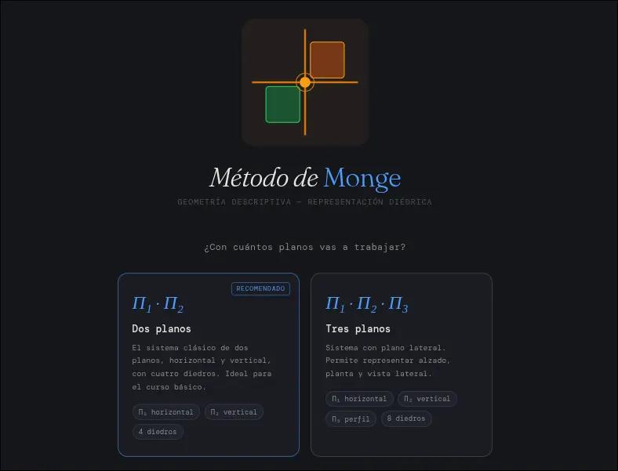
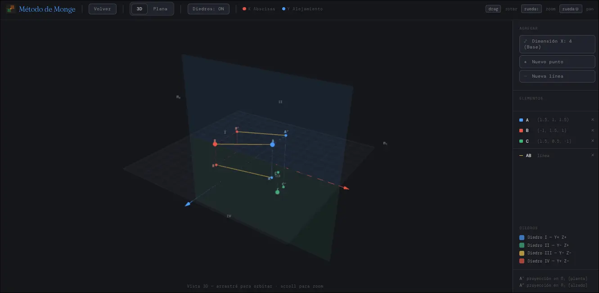
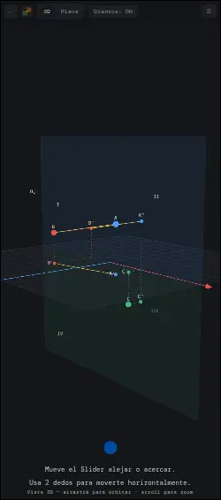
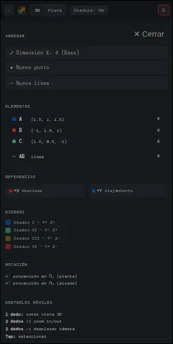
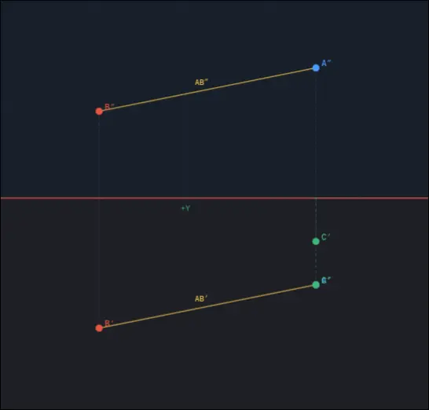

# Método de Monge


Una aplicación web interactiva para el estudio de la Geometría Descriptiva y el Sistema Diédrico, desarrollada como herramienta didáctica moderna para el aprendizaje de la representación gráfica.

## 📖 Acerca del Proyecto

Este proyecto fue desarrollado por **Eitan Steven Gil**, alumno de la carrera de Minería del **Instituto Superior de Formación Técnica N° 130** (https://instituto130.com.ar/wp/).

La aplicación tiene como finalidad:
- **Ayudar al estudio** de los alumnos mediante una herramienta visual e interactiva.
- **Otorgar una herramienta didáctica** a los profesores para la enseñanza en el aula.
- **Actualizar bibliografías** con recursos digitales modernos.

## 🎯 Características Principales

### Sistema Diédrico Interactivo
- **Vista 3D**: Visualización tridimensional de puntos y lineas en el espacio con proyecciones sobre los planos Π₁ (horizontal) y Π₂ (vertical)
- **Vista Plana (2D)**: Representación diédrica clásica con los planos desplegados
- **Configuración flexible**: Soporte para 2 planos (sistema clásico) o 3 planos (incluyendo Π₃ lateral)

### Controles Adaptados para Mobile
- **Zoom y paneo** en ambas vistas (3D y 2D)
- **Controles táctiles móviles**: 1 dedo para rotar, 2 dedos para zoom y paneo
- **Slider de zoom personalizado** con retorno a posición inicial
- **Navegación intuitiva** entre vistas

### Interfaz Moderna
- **Diseño responsive** optimizado para desktop y mobile
- **Splash screen** de bienvenida con selector de configuración
- **Visualización de diedros** (1-4 o 1-8 según configuración)
- **Ayudas visuales** con tips de navegación

## 📸 Capturas de Pantalla

### Página de Inicio


### Vista 3D


### Vista 3D en Móvil


### Vista 3D con Planos


### Vista Plana (2D)


## 🚀 Tecnologías Utilizadas

- **React 19** - Biblioteca de interfaz de usuario
- **Three.js** - Renderizado 3D WebGL
- **Vite** - Herramienta de construcción y desarrollo
- **CSS Moderno** - Estilos con variables CSS y diseño responsive

## 📦 Instalación

```bash
# Clonar el repositorio
git clone <repository-url>
cd monge-react

# Instalar dependencias
npm install

# Ejecutar en modo desarrollo
npm run dev

# Construir para producción
npm run build

# Previsualizar build de producción
npm run preview
```

## 🌐 Prueba la App en:

La aplicación está desplegada en GIthub Pages [[Visitar](https://eitansteven.github.io/monge_3d/)]

## 🎓 Créditos

**Desarrollador**: Eitan Steven Gil  
**Institución**: Instituto Superior de Formación Técnica N° 130  
**Carrera**: Tecnicatura Superior en Mineria
**Año**: 2026

## 📄 Licencia

Este proyecto es de uso educativo, desarrollado con fines académicos para el Instituto Superior de Formación Técnica N° 130 o cualquier alumno, profesor, o interesado ¡Uso libre y Opencode!
